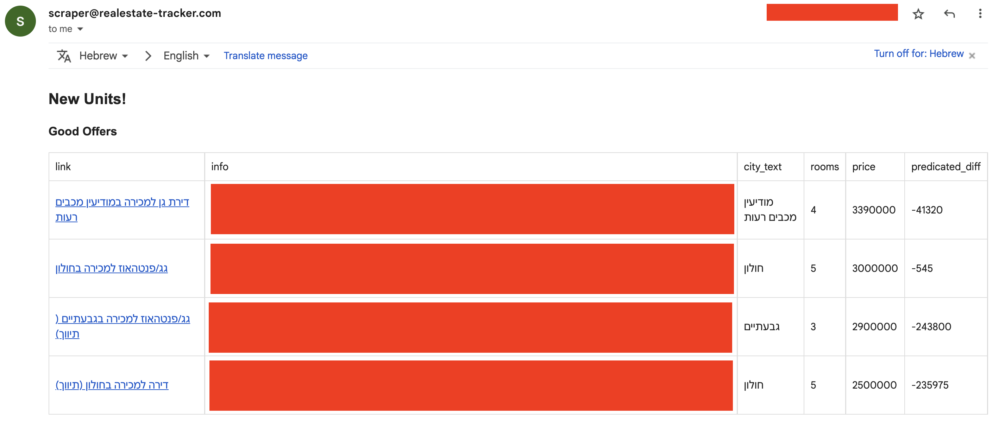

# Real Estate Tracker

This project tracks and processes real estate deals from the leading Israeli real-estate website [Yad2](https://www.yad2.co.il).
The "good" deals are filtered and sent to my email address.

## Tracking real estate deals

The tracking is built on the [yad2](https://www.yad2.co.il) notification mechanism, where you can set a query to run periodically and send the new real-estate deals that match the query to the user email.
Using terraform, I set an AWS SES to listen to these emails, save them to S3, parse them in an AWS lambda, and save the parsed units in a DynamoDB table.
When parsing the real-estate units in the lambda, the "good" deals are filtered and sent to my email.

## Identifying good deals

To identify what is a good deal, I train a [Random Forest Regressor](https://scikit-learn.org/stable/modules/generated/sklearn.ensemble.RandomForestRegressor.html) model to predict the price of a unit based on its parameters using all the real-estate units I have collected so far in the DynamoDB table.
Then for each new unit, I try to predict its price and if it is cheaper than I predicted, it is considered to be a "good" deal.

<br/>



## Running locally

To test the parser locally with a test input, run:
```
python3 src/parser.py
```

To generate the data for training the model, check the data folder's [README](data/README.md)

To train the model, run:
```
python3 src/train_model.py
```

To test the accuracy of the model, run:
```
python3 src/train_model.py --test
```

## Deploying to AWS

First, generate the package for the AWS lambda by running:
```
pipenv run package
```

Then, deploy all the AWS services by running:
```
pipenv run deploy
```

**_NOTE:_** There are some hard coded values that are specific to me that might need to be changed (my email, the AWS SES receiver email).
